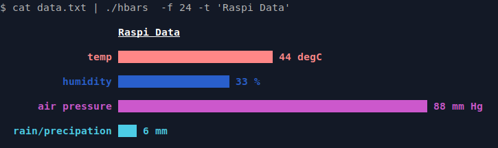

# hbars - create horizontal bar in Bash script
The **_hbar_** script can be used to create text based or web page horizontal bars.




```bash
$ ./hbars
usage: hbars [data] [option] 
  -h --help     print this usage and exit
  -c --color    set color to all bars (default 7=white)
                 (0-grey,1-red,2=green,3=yellow,4=blue,5=magenta,6=cyan,7=white)
  -p --pretty   add different colors to bars (-c overrides)cat data.txt | ./hbars -W -f 24 -t 'Raspi Data' 
  -t --title    top title
  -w --width    max width of bar (default 50)
  -W --Web      make output HTML formatted
  -f --fontsize fontsize for web output (default 24)

 examples:
   echo 'temp,33,C;pressure,14,psi' | ./hbars -t Weather -p -w 40 
   ./hbars -t Weather -p -w 40  'temp,33;pressure,14' 
   cat data.txt | ./hbars -W -f 24 -t 'Raspi Data' > data.htm

```


## Background

To create a static bar an *printf* statements can be used. The seq {0..10} can be used to repeat an ASCII '█' fill character 10 times.
```bash
$ printf 'LABEL: ' ; \
  printf '█%.0s' {1..10} ; \
  printf ' 10\n'

LABEL: ████████████████████ 10
```
Unfortunately the printf statement has some limitations on variable substitution. A simple workaround is to create a string and then eval it:
```bash
$ label="temp"; val=20;
$ bar="printf '█%.0s' {1..$val}" ; 
$ printf '\n%-5s ' $label; eval $bar ; printf ' %d\n' $val

temp  ████████████████████ 20
```

## Colored Bar

The **_tput setaf_** command can change the foreground, and tput setab is used for background colours. Colour codes are:
```text
tput setab [1-7] # Set the background colour using ANSI escape
tput setaf [1-7] # Set the foreground colour using ANSI escape

Num  Colour    #define         R G B

0    black     COLOR_BLACK     0,0,0
1    red       COLOR_RED       1,0,0
2    green     COLOR_GREEN     0,1,0
3    yellow    COLOR_YELLOW    1,1,0
4    blue      COLOR_BLUE      0,0,1
5    magenta   COLOR_MAGENTA   1,0,1
6    cyan      COLOR_CYAN      0,1,1
7    white     COLOR_WHITE     1,1,1
```
To reset colours back to the defaults use: **_tput sgr0_**
